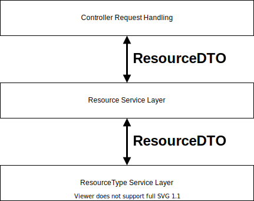

# Resource Management App

## Architecture

The following key challanges needed to be addressed:
 1. We need the resource types to be extensible for the future to add new types of resources (e.g. text files, videos... etc)
 2. Storing resources needs to be a safe operations without losing data (ACID)
 3. Retrieving / Sorting data needs to be optimial performance

For this type of system with unexpected and unrelated information, we would optimially use a nosql database. However, using the stack we have at hand, we will solve this for a relational database.

Models for data could be as simple as creating a Resource model with two attributes:
   ```
   Resource
   ----------
   + id: int
   + string: type
   + json: string
   ```

The json attribute will contain all the data related to this resource type. This will replicate a nosql database but the issue here is that our json attribute is not indexable by the DB making accessing and aggregating data slower. The other issue is that json read + write will require extra logic implementation to insure consistant data.

In order to address these issues, I created subtype models for each type of resource and used the Stratagy pattern to handle creating, retrieving, updating and deleting this model.

For convienience I used the Service Layer architectual pattern to loose couple the controller JSON logic from the business logic. These layers interact with each user using data transfer objects (DTOs).

## Design Decisions

 - The front end app is using blade for routing in order to achieve a multi page application. This is in the vision of the benifits of an MPA for SEO.
 - No data validation is conducted just to speed up process albiet the inputted data is secured by Laravel.

## UML Diagram


## Service Layers Diagram



## Local Environemnt Requirments

You will need to have **Docker**, **PHP** and **Comoser** installed. This has been tested using:
**Docker** version: `20.10.8`
**PHP** version: `8.0.5`
**Composer** version: `2.0.11`

## Deployment Instructios

 1. run `composer install`
 2. run `./vendor/bin/sail up`
 3. copy `.env.example` and rename to `.env`
 4. run `./vendor/bin/sail artisan key:generate`
 5. run `./vendor/bin/sail artisan migrate`
 6. (optional) run `./vendor/bin/sail artisan db:seed` if you want to seed the app with random data
 7. run `./vendor/bin/sail artisan storage:link`
 8. (optional / have issues with frontend) run `./vendor/bin/sail npm install; ./vendor/bin/sail npm run prod`
 9. make sure `.env` has the following variables set to the correct url:
    ```
    APP_URL=http://localhost
    MIX_APP_URL=http://localhost
    MIX_API_URL=http://localhost/api/v1
    ```
 10. open browser on [http://localhost/admin](http://localhost/admin) for admin page to create resources
 11. open browser on [http://localhost/](http://localhost/) for visitor page to view resources
 12. you can view database using PHPMyAdmin on [http://localhost:8080](http://localhost:8080)
 13. run `./vendor/bin/sail test` to run PHPUnit tests
